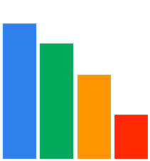

  

<h1 align="center">Hello, I'm Gamaliel - Developer</h1>

 💻 I am a developer specialized in mobile development and with experience with development companies. 📱 

- 👨‍💻 I always like to be updated in mobile or web development. 
- 📚 I like to learn new programming languages ​​or tools. 

 

 
 

---

<h3 align="center">Languages and Tools</h3>

    
    
    
    
    
    
    
    
    
    
    
    
    
    

---
<h3 align="left"> GitHub Stats</h3>

  <a href="https://github.com/Gamaliel-developer">
  
  

---

## :exclamation: Disclaimer
                                                   TO BE USED FOR Education Purpose

All tools may only be used for lawful purposes. Users take full responsibility for any action taken using the tool(s). The author declines all responsibility for damage caused by these tools offered on his page. If these terms do not suit you, do not use these tools.
By using the tools you declare that you have taken cognizance of the terms of this
